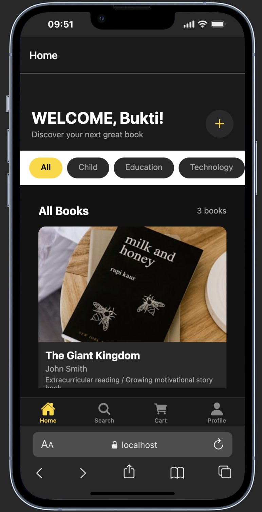
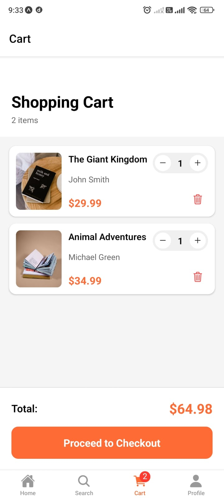
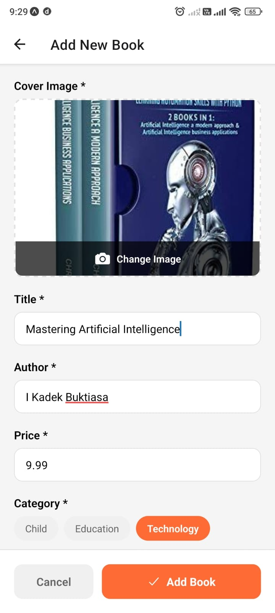
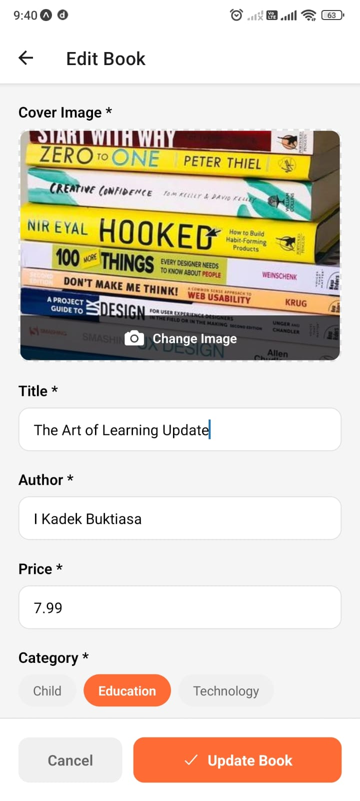
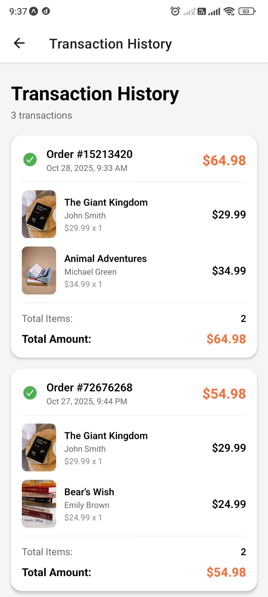
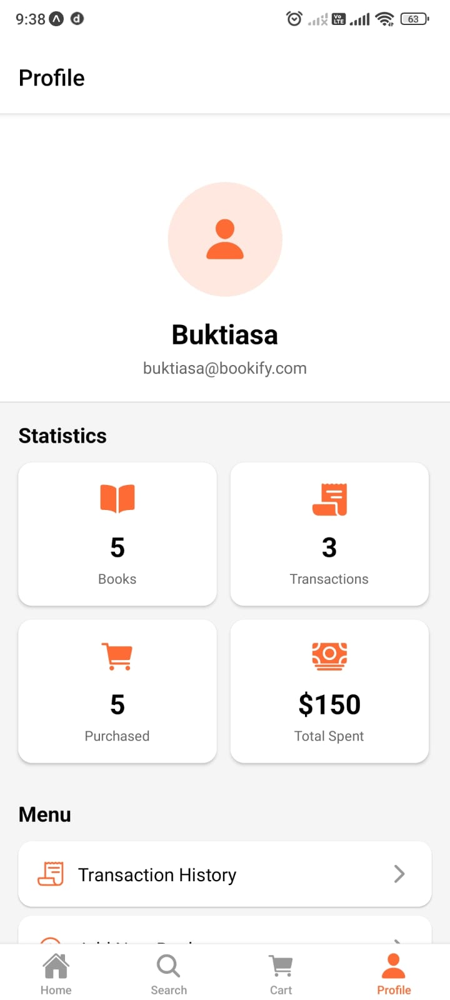
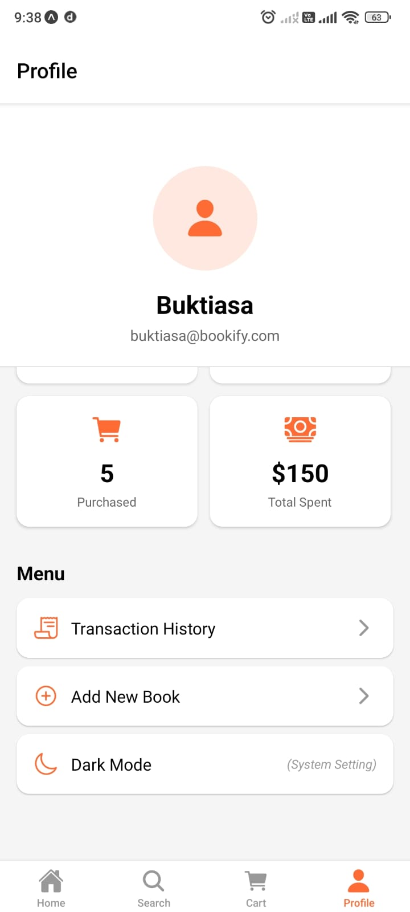

# 📚 Bookify - Aplikasi Mobile Toko Buku

Bookify adalah aplikasi mobile toko buku yang dikembangkan menggunakan React Native dan Expo. Aplikasi ini memungkinkan pengguna untuk menjelajahi, mencari, dan membeli buku secara online, serta mendukung mode gelap (dark mode) yang menyesuaikan dengan tema perangkat pengguna.

## 🚀 Fitur Utama

- **Katalog Buku**: Jelajahi berbagai buku dengan tampilan yang menarik
- **Pencarian**: Cari buku berdasarkan judul, penulis, atau kategori
- **Detail Buku**: Lihat informasi lengkap tentang buku
- **Keranjang Belanja**: Tambahkan buku ke keranjang dan kelola pembelian
- **Profil Pengguna**: Kelola informasi profil dan riwayat transaksi
- **Mode Gelap/Terang**: Dukungan tema gelap dan terang

## 🛠️ Teknologi yang Digunakan

- **React Native**: Framework untuk pengembangan aplikasi mobile
- **Expo**: Platform untuk membangun dan men-deploy aplikasi React Native
- **Expo Router**: Navigasi berbasis file untuk aplikasi Expo
- **Zustand**: Manajemen state yang ringan dan efisien
- **React Native Paper**: Komponen UI Material Design
- **AsyncStorage**: Penyimpanan data lokal

## 📋 Prasyarat

- Node.js (versi 16 atau lebih baru)
- npm atau yarn
- Expo CLI
- Emulator Android/iOS atau perangkat fisik

## 🔧 Instalasi

1. Clone repositori ini

   ```bash
   git clone <url-repositori>
   cd bookify-v4
   ```

2. Instal dependensi

   ```bash
   npm install
   # atau
   yarn install
   ```

3. Jalankan aplikasi

   ```bash
   npm start
   # atau
   yarn start
   ```

4. Pilih platform untuk menjalankan aplikasi:
   - Tekan `a` untuk Android
   - Tekan `i` untuk iOS
   - Tekan `w` untuk web

## 📱 Struktur Aplikasi

```
bookify-v4/
├── app/                   # Direktori utama aplikasi (Expo Router)
│   ├── (tabs)/            # Tab navigasi utama
│   ├── book/              # Halaman detail, tambah, dan edit buku
│   └── transactions.tsx   # Halaman transaksi
├── assets/                # Gambar dan aset lainnya
├── components/            # Komponen yang dapat digunakan kembali
├── constants/             # Konstanta aplikasi
├── hooks/                 # Custom hooks
├── store/                 # State management (Zustand)
├── type/                  # Type definitions
└── utils/                 # Fungsi utilitas
```

## 🧩 Komponen Utama

- **BookCard**: Menampilkan informasi buku dalam format kartu

## 🖼️ Preview













## 🎥 Demo Aplikasi

🎥 [Tonton Demo Aplikasi di Loom](https://www.loom.com/share/c927dfdd7534435ca4ae91abb38c91ea)

## 📝 Pengembangan

Untuk reset proyek ke kondisi awal:

```bash
npm run reset-project
```

---

Dibuat oleh Buktiasa untuk Kuliah Pemrograman Mobile
